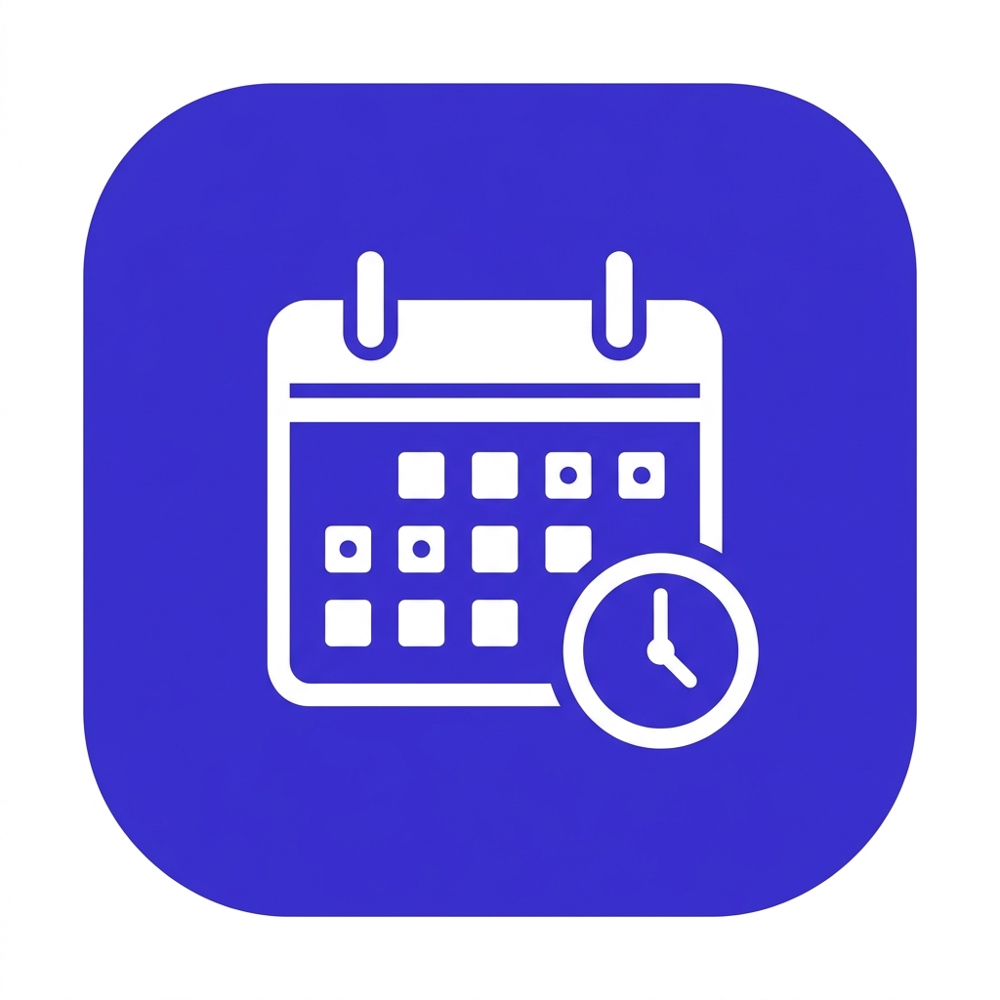
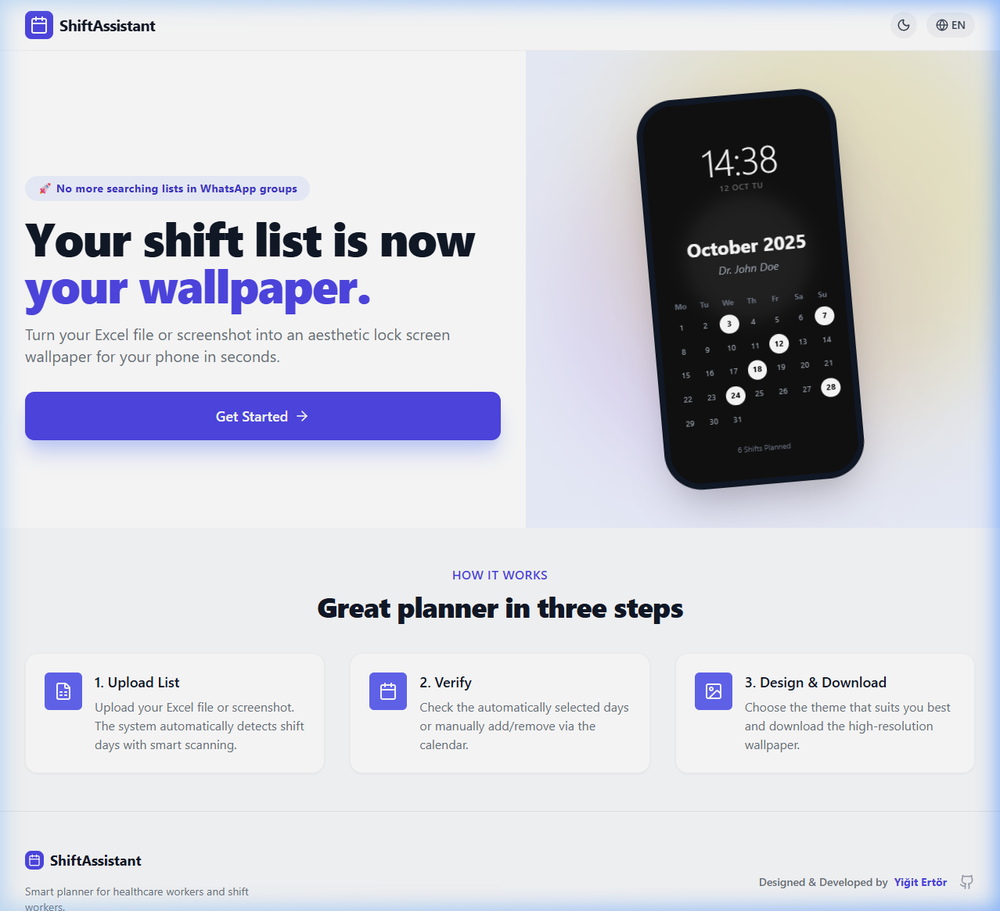
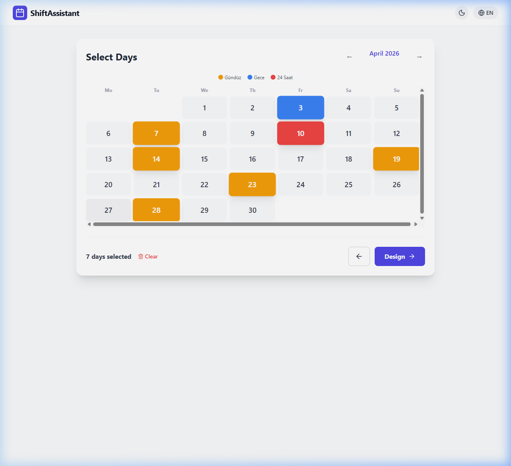
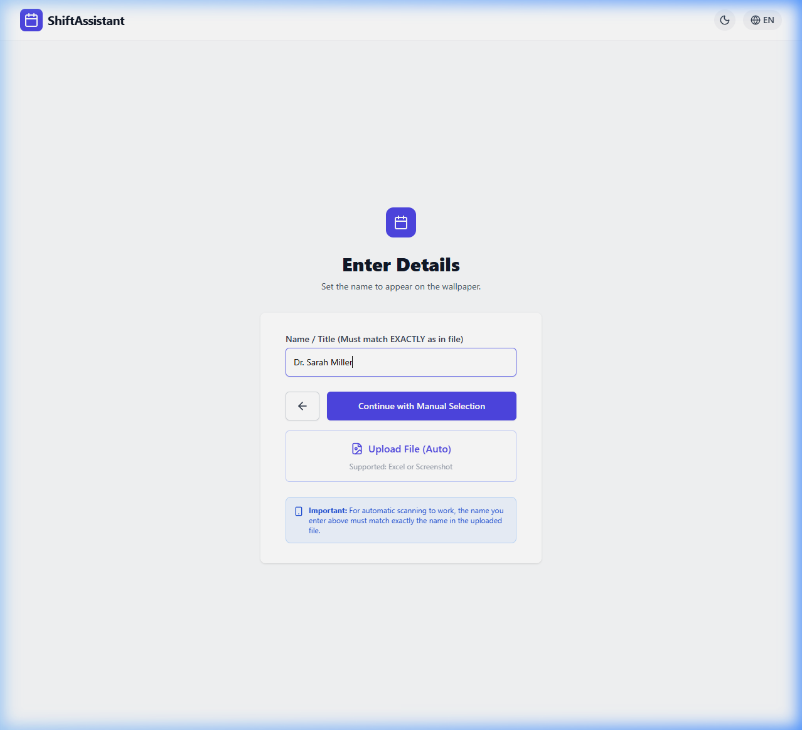
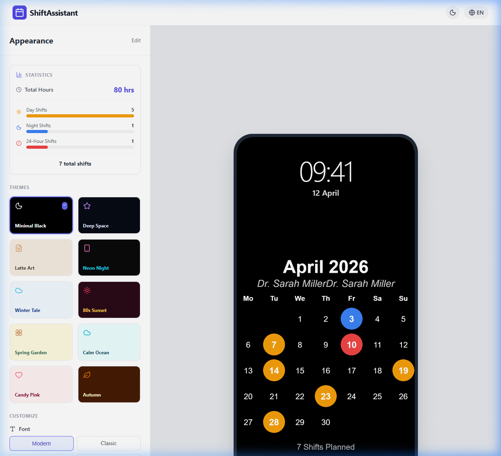

<p align="center">
  
</p>

<h1 align="center">ShiftAssistant (NöbetAsistanı)</h1>

<p align="center">
  <strong>Transform your shift schedule into a beautiful lock screen wallpaper in seconds.</strong>
</p>

<p align="center">
  <a href="#features">Features</a> •
  <a href="#screenshots">Screenshots</a> •
  <a href="#tech-stack">Tech Stack</a> •
  <a href="#getting-started">Getting Started</a> •
  <a href="#deployment">Deployment</a> •
  <a href="#project-structure">Structure</a> •
  <a href="#license">License</a>
</p>

<p align="center">
  
  
  
  
  
  
</p>

---

## 🎯 About

**ShiftAssistant** is a web application designed for healthcare workers, doctors, nurses, and anyone who works on rotating shift schedules. Instead of constantly checking WhatsApp groups or pinned Excel files for your shift days, this app turns your shift schedule into an **aesthetic phone lock screen wallpaper** — so your schedule is always visible at a glance.

### The Problem
- 📱 Constantly opening WhatsApp groups to check shift lists
- 📊 Zooming into tiny Excel files on your phone
- 🗓️ Manually adding each shift to your calendar app
- 🤯 Forgetting which days you're on duty

### The Solution
Upload your Excel file or a screenshot of your shift schedule → the app automatically detects your shifts using **AI-powered OCR** → customize the design with 10+ themes → download a **high-resolution wallpaper** optimized for your phone's lock screen.

---

## ✨ Features

### Core Functionality
- 📤 **Smart File Upload** — Upload Excel (`.xlsx`/`.xls`) files or screenshot images
- 🤖 **AI-Powered OCR** — Gemini 2.0 Flash analyzes images to detect shift days and types automatically
- 🎨 **10 Beautiful Themes** — Minimal Black, Deep Space, Neon Night, Winter Tale, and more
- 📲 **1080×1920 Wallpaper Export** — Pixel-perfect output optimized for phone lock screens
- 📅 **ICS Calendar Export** — One-click export to Apple Calendar, Google Calendar, or Outlook

### Shift Types
- ☀️ **Day Shift** (Gündüz) — Amber colored
- 🌙 **Night Shift** (Gece) — Blue colored  
- 🚨 **24-Hour Shift** (24 Saat) — Red colored

### New Features
- 📊 **Shift Statistics** — Visual breakdown of day/night/24h shifts with total hours estimation
- 🔗 **Share via URL** — Generate a shareable link for your shift plan (Web Share API + clipboard fallback)
- 🔔 **Push Notifications** — Set reminders for the day before each shift (configurable time)
- 🖼️ **Custom Background** — Upload your own photo as the wallpaper background
- ✏️ **Font Selection** — Choose from Modern, Classic, Typewriter, or Handwritten styles

### User Experience
- 🌍 **Multi-language** — Turkish, English, and German
- 🌙 **Dark Mode** — Full dark mode support across all screens
- 📱 **PWA Ready** — Install as a native app on your phone
- 💾 **Auto-save** — Your progress is saved in localStorage between sessions
- 🎭 **Live Preview** — Real-time phone mockup preview as you customize

---

## 📸 Screenshots

<table>
  <tr>
    <td align="center"><strong>Landing Page</strong></td>
    <td align="center"><strong>Calendar Selection</strong></td>
  </tr>
  <tr>
    <td></td>
    <td></td>
  </tr>
  <tr>
    <td align="center"><strong>Input Form</strong></td>
    <td align="center"><strong>Preview & Export</strong></td>
  </tr>
  <tr>
    <td></td>
    <td></td>
  </tr>
</table>

---

## 🏗️ Tech Stack

| Layer | Technology |
|-------|-----------|
| **Frontend** | React 19, Vite 5 |
| **Styling** | Tailwind CSS 3.4 |
| **Icons** | Lucide React |
| **AI / OCR** | Google Gemini 2.0 Flash (with 1.5 Pro fallback) |
| **Serverless** | Netlify Functions |
| **PWA** | vite-plugin-pwa |
| **Excel Parsing** | SheetJS (XLSX) — loaded on demand |
| **Calendar Export** | Native ICS generation |

---

## 🚀 Getting Started

### Prerequisites
- [Node.js](https://nodejs.org/) 18+ 
- npm or yarn

### Installation

```bash
# Clone the repository
git clone https://github.com/yigitertor/ShiftAssistant.git
cd ShiftAssistant

# Install dependencies
npm install

# Start development server
npm run dev
```

The app will be available at `http://localhost:5173`.

### Environment Variables

For the AI-powered image analysis to work, you need a Gemini API key:

```env
# Set in Netlify Dashboard → Site Settings → Environment Variables
GEMINI_API_KEY=your_gemini_api_key_here
```

> **Note:** The Gemini API is only used server-side via Netlify Functions. It is never exposed to the client.

---

## 📦 Deployment

### Netlify (Recommended)

The project is configured for one-click Netlify deployment:

1. Push your code to GitHub
2. Connect the repo to [Netlify](https://app.netlify.com)
3. Add `GEMINI_API_KEY` in **Site Settings → Environment Variables**
4. Deploy! Netlify will automatically use the config in `netlify.toml`

```toml
# netlify.toml
[build]
  command = "npm run build"
  publish = "dist"

[functions]
  directory = "netlify/functions"
```

### Manual Build

```bash
npm run build    # Outputs to ./dist
npm run preview  # Preview production build locally
```

---

## 📁 Project Structure

```
ShiftAssistant/
├── public/                          # Static assets
│   ├── favicon.png                  # App favicon
│   ├── pwa-192x192.png              # PWA icon (192px)
│   ├── pwa-512x512.png              # PWA icon (512px)
│   ├── apple-touch-icon.png         # iOS icon
│   └── manifest.json                # PWA manifest
├── netlify/
│   └── functions/
│       └── analyze-image.js         # Gemini AI OCR serverless function
├── src/
│   ├── components/
│   │   ├── Header.jsx               # Navigation bar (dark mode, language)
│   │   ├── Footer.jsx               # Footer with credits
│   │   ├── ShiftStats.jsx           # Shift statistics panel
│   │   ├── ShiftNotification.jsx    # PWA notification settings
│   │   └── steps/
│   │       ├── HeroSection.jsx      # Landing page hero
│   │       ├── InputForm.jsx        # Name input & file upload
│   │       ├── CalendarSelection.jsx # Interactive calendar
│   │       └── PreviewEditor.jsx    # Theme picker & wallpaper preview
│   ├── constants/
│   │   ├── themes.js                # 10 theme definitions
│   │   └── translations.js          # i18n strings (TR/EN/DE)
│   ├── context/
│   │   └── LanguageContext.jsx      # Language provider
│   ├── utils/
│   │   ├── canvasUtils.js           # Wallpaper rendering logic
│   │   ├── dateUtils.js             # Calendar helpers
│   │   └── scriptLoader.js          # Dynamic script loader (XLSX)
│   ├── App.jsx                      # Main app orchestrator
│   ├── main.jsx                     # Entry point
│   └── index.css                    # Global styles & animations
├── index.html                       # HTML entry point
├── vite.config.js                   # Vite + PWA config
├── tailwind.config.js               # Tailwind configuration
├── netlify.toml                     # Netlify deployment config
└── package.json                     # Dependencies & scripts
```

---

## 🔄 How It Works

```
┌─────────────┐     ┌──────────────┐     ┌─────────────────┐     ┌──────────────┐
│  1. Upload   │────▶│  2. Detect   │────▶│  3. Customize   │────▶│  4. Export    │
│  Excel/Image │     │  Shifts (AI) │     │  Theme & Style  │     │  Wallpaper   │
└─────────────┘     └──────────────┘     └─────────────────┘     └──────────────┘
       │                    │                      │                      │
  File Upload        Gemini 2.0 Flash       Canvas Rendering       PNG Download
  or Manual         + SheetJS Parser        + Live Preview         + ICS Export
  Selection                                                       + URL Share
```

### AI-Powered Shift Detection

When a user uploads a screenshot of their shift schedule:

1. The image is converted to Base64 with its real MIME type
2. Sent to a Netlify Function (`analyze-image.js`)
3. The function calls **Gemini 2.0 Flash** with a structured prompt
4. Gemini returns shift days **with types** (`day`, `night`, `full`)
5. Falls back to **Gemini 1.5 Pro** if the primary model fails
6. Results are rendered on the interactive calendar

### URL Sharing Format

Shift plans can be shared via URL:
```
https://yoursite.com/?n=Dr.Smith&m=3&y=2026&s=1:n,5:d,12:f,18:n
```
- `n` — Name
- `m` — Month (0-indexed)
- `y` — Year
- `s` — Shifts (day:type, where d=day, n=night, f=full)

---

## 🎨 Available Themes

| Theme | Style | Background |
|-------|-------|-----------|
| Minimal Black | Dark | Pure black with white text |
| Deep Space | Dark | Starfield with nebula effects |
| Latte Art | Light | Warm coffee tones with ☕ emojis |
| Neon Night | Dark | Cyberpunk grid with neon accents |
| Winter Tale | Light | Snowfall effect with ❄️ |
| 80s Sunset | Dark | Retro purple-orange gradients |
| Spring Garden | Light | Floral patterns with 🌸 |
| Calm Ocean | Light | Serene teal waves |
| Candy Pink | Light | Soft pastel rose |
| Autumn | Dark | Warm brown with 🍁 leaves |

---

## 🤝 Contributing

Contributions are welcome! Here's how you can help:

1. Fork the repository
2. Create a feature branch (`git checkout -b feature/amazing-feature`)
3. Commit your changes (`git commit -m 'Add amazing feature'`)
4. Push to the branch (`git push origin feature/amazing-feature`)
5. Open a Pull Request

---

## 📄 License

This project is open source and available under the [MIT License](LICENSE).

---

## 👤 Author

**Yiğit Ertör**

- GitHub: [@yigitertor](https://github.com/yigitertor)

---

<p align="center">
  <sub>Built with ❤️ for healthcare workers who deserve a better way to check their shifts.</sub>
</p>
